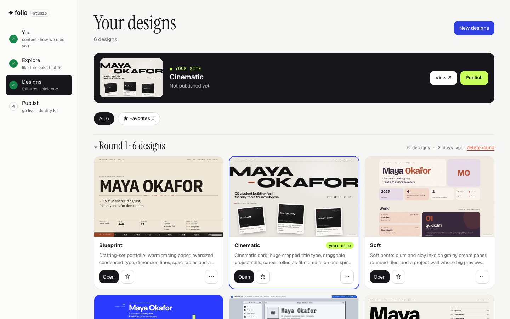
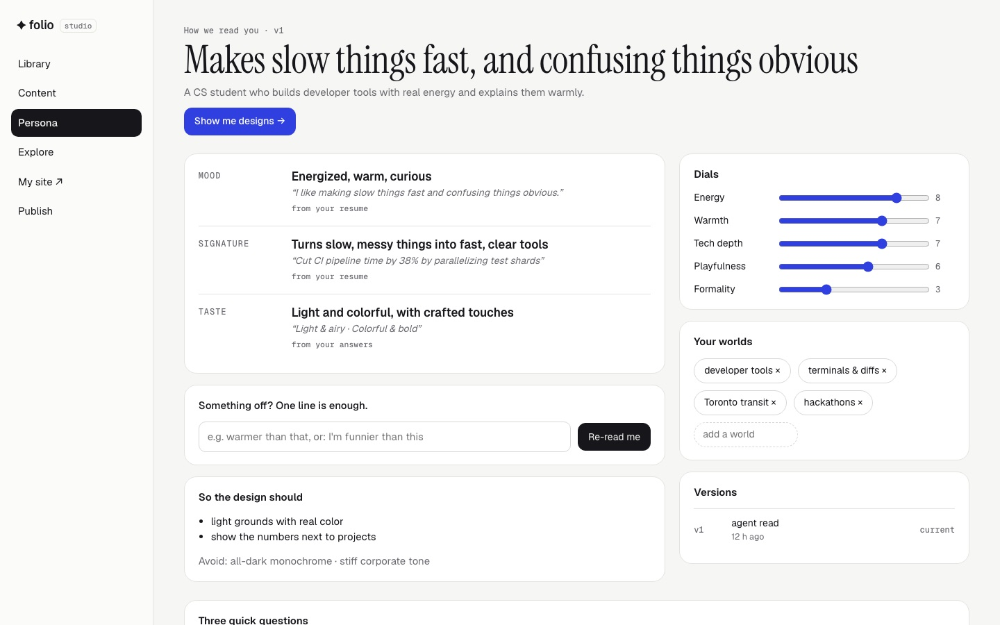
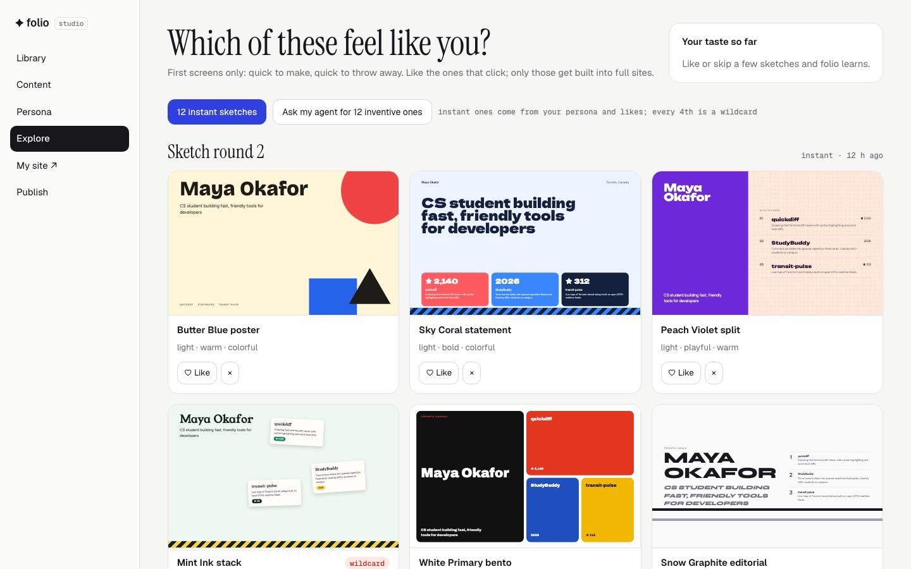
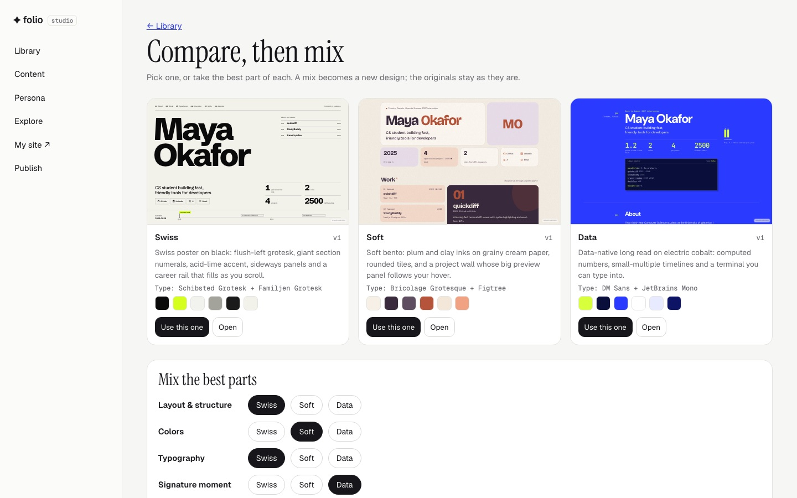
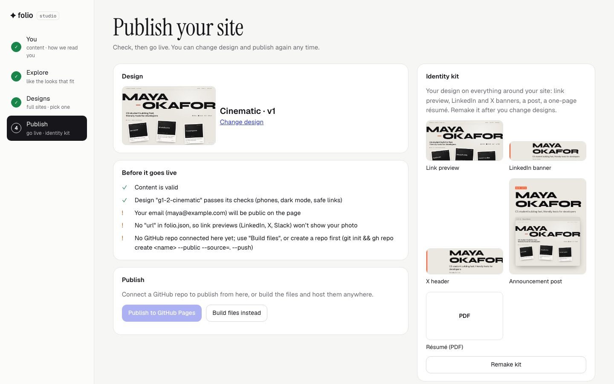
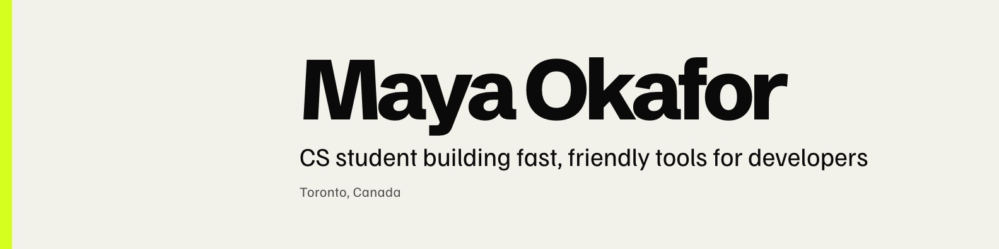
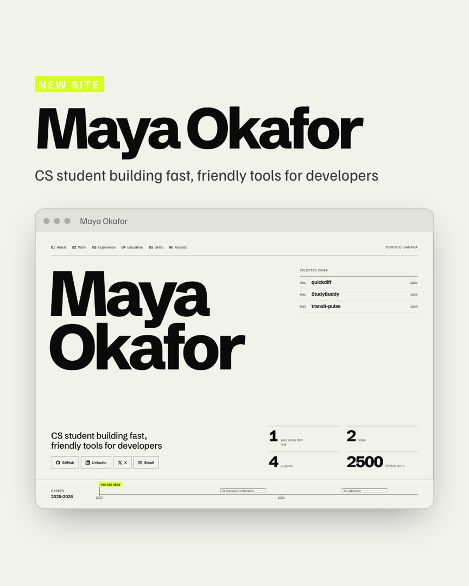

<div align="center">

# ✦ folio

**Six designers. One you.**

[](https://github.com/munshi007/folio/actions/workflows/test.yml) [](https://www.npmjs.com/package/folio-site) [](LICENSE)

folio reads who you are from your resume and GitHub, shows you a dozen quick sketches, and builds the ones you like into **real, genuinely different portfolio sites**. Pick one, refine it, publish free on GitHub Pages, and take the look everywhere: LinkedIn banner, link previews, résumé PDF.

```bash
npx folio-site studio
```
<sub>or with an agent: <code>npx skills add munshi007/folio</code>, then <i>"make my portfolio from resume.pdf"</i></sub>

<br>



<sub>Folio Studio, local in your browser: four steps from your resume to a live site. Keep what you like, delete the rest. (Fictional demo profile.)</sub>

</div>

---

## Not a template

Portfolio generators give everyone the same five themes. folio briefs **a different designer per direction**, built around your actual work. These six came out of one round on one profile:

| | | |
|:-:|:-:|:-:|
|  |  |  |
| **Swiss poster:** scrolls sideways, career chart pinned to the bottom | **Cinematic:** film title card, draggable project "stills" | **Data-native:** every number computed from your data, plus a terminal visitors can type into |
|  |  |  |
| **Retro OS:** projects are files, roles are processes, a live local clock | **Soft:** plum and clay tiles with a hover preview panel | **Blueprint:** an engineering drawing with a scrolling bill of materials |

None of these existed before the run. Run it again and you get six different ones. `folio bench` measures this: how different the designs in a round really are, compared with just prompting a model.

## How it works

### 1. It reads you, and shows you how
Upload your resume or import GitHub. folio's agent writes your content (it **never invents** numbers, employers or dates), then a **persona card**: your mood, voice and taste, each backed by your own words, plus dials you can drag. Three quick questions keep a formal CV from making everything dark and serious. Wrong? Say so in one line and it re-reads you.



### 2. Sketches first, sites second
Instead of six full sites up front, **Explore** shows a dozen first screens in seconds: different layouts, palettes, type and motifs, sampled from your persona, with a wildcard every fourth. Like or skip; folio learns your taste and the next round leans your way. Only the ones you like get built.



References come from **your worlds** (an astronomer gets star atlases, a transit nerd gets route maps), kept as principles plus a credit link, never copied images or text.

### 3. Build, compare, mix
Each liked sketch becomes a complete site, checked before it counts (escaping, unsafe links, phones, dark mode, focus, reduced motion) and reviewed from real screenshots. Put two to four side by side, or **mix** them: layout from one, colors from another, type from a third.



**More like this** keeps what you like (vibe, colors, type, layout or signature moment) and gets three siblings that change two big things each. Every edit is a version you can restore, and **Clean up** removes what you don't need: archived designs, unfinished drafts, old rounds or old versions.

### 4. Publish, and take it everywhere
A pre-flight checklist (it flags a phone number or street address before it goes public), then GitHub Pages in one click, or plain files for any host. The **identity kit** carries your design onto a link preview, LinkedIn and X banners, an announcement post and a one-page résumé PDF.



 

## Quick start

Needs **Node.js 22.4+**. Chrome or Chromium is used for screenshots, the identity kit and the benchmark, if you have it.

Three ways to do the design work. Same Studio, same results:

**1. Your coding agent** (Claude Code, Cursor, Codex, OpenCode…)
```bash
npx skills add munshi007/folio
```
> make my portfolio from ~/Downloads/resume.pdf, my GitHub is octocat

**2. Your API key, no agent**
```bash
export ANTHROPIC_API_KEY=sk-ant-...
npx folio-site init --github <you>
npx folio-site studio          # every waiting job gets a "Build now" button
```

**3. Any MCP app** (Claude, Cursor, VS Code…): see [below](#use-it-from-your-ai-app-mcp).

Just want a site in two minutes? `npx folio-site init --github <you> && npx folio-site deploy` with one of the four built-in themes.

## Your design, everywhere

`folio kit` (or Studio → Publish → Identity kit) carries your chosen design onto everything around the site: a link preview (`og.png`, used automatically by `folio build` when `url` is set), a LinkedIn banner, an X header, an announcement post and a one-page résumé PDF. Fonts and colours are read from your rendered site, so it works for any design, including ones your agent made.

## No coding agent? Use your API key

```bash
export ANTHROPIC_API_KEY=sk-ant-...
folio generate --run          # start a round and build it right away
folio run                     # or: do whatever is waiting (rounds, persona, sketches, your resume)
```

With the key set, `folio studio` also shows **Build now with my API key** on every waiting job. The key is only sent to api.anthropic.com and is never saved. Generated designs pass the same checks as agent-made ones, and code that reaches for modules, the process or the network is refused before it's written. Pick a model with `--model` or `FOLIO_MODEL`.

## Use it from your AI app (MCP)

folio is also an MCP server, so Claude, Cursor, Codex, VS Code and other MCP clients can drive it directly: open Studio, read and write the persona, add references, make sketches, start rounds, claim designs, check them.

```bash
claude mcp add folio -- npx -y folio-site@latest mcp     # Claude Code
```

Other clients take the same command in their MCP settings:

```json
{ "mcpServers": { "folio": { "command": "npx", "args": ["-y", "folio-site@latest", "mcp"] } } }
```

The repo is also a Claude Code plugin (skill + MCP server together, see `.claude-plugin/`).

## Tweak without code

The preview has a control bar: pick the **design**, force **light/dark**, swap the **font** (serif, sans, mono), **reorder or hide sections**. Every click is saved to `folio.json`, and works on every design, including generated ones:

```json
{
  "theme": "g1-2-cinematic",
  "accent": "#16a34a",
  "style": { "mode": "dark", "font": "serif", "sections": ["projects", "experience", "about"], "hide": ["awards"] }
}
```

Bigger changes, like *"make the name smaller and the projects louder"*, go to your agent. It edits the design, re-checks it and re-screenshots it.

## Built-in themes

For a quick start without generating, four hand-tuned themes ship with folio: **bento**, **editorial**, **terminal** and **blueprint**. Blueprint was itself the first output of the design loop. They're also the starting points for `folio theme new <name> --from <theme>`.

   

## Commands

| Command | What it does |
|---|---|
| `folio init [--github <user>]` | Create `folio.json`, optionally from your GitHub profile |
| `folio github <user>` | Merge profile + top repos into `folio.json` (never overwrites what you wrote) |
| `folio generate [--count 6] [--seed n]` | Brief N different designers for your agent; watch them land in the gallery |
| `folio generate --like <design> [--keep vibe\|colors\|type\|layout\|signature]` | "More like this": siblings that keep what you liked and change two big things each |
| `folio pick <design> [--as <name>]` | Keep a generated design under a proper name and set it in `folio.json` |
| `folio studio` | Open Folio Studio: Library, Persona, Explore (sketches), Compare + mix, Publish |
| `folio persona [write <file>]` · `folio refs [add <file>]` · `folio sketch auto\|add\|show` | Persona card, reference board, first-screen sketches (agents write; you correct in Studio) |
| `folio jobs [next \| cancel <id>]` | Generation progress; agents claim the next design or task |
| `folio run` | Build waiting designs (and persona, sketches, resume reading) with your own `ANTHROPIC_API_KEY`, no agent needed |
| `folio kit` | Identity kit in your design: link preview, LinkedIn and X banners, announcement post, one-page résumé PDF |
| `folio mcp` | Run as an MCP server for AI apps |
| `folio dev` | The same local server without opening a browser (Studio at `/studio`, your site at `/`) |
| `folio build [--out dist]` | Render the static site |
| `folio deploy` | Build and publish to GitHub Pages (asks first) |
| `folio validate` | Check `folio.json` and get content suggestions |
| `folio themes` | List built-in, local and generated designs |
| `folio theme new <name> [--from <theme>]` | Scaffold your own design in `themes/<name>.js` |
| `folio theme check <name>` | Safety and quality checks for a design |
| `folio shot [--theme <name>] [--pure]` | Full-page shots plus one image per real screen, desktop and phone, light and dark; reports page script errors |

## What you get

- **One static page**, no framework, no build step, nothing in `node_modules`. Fast anywhere.
- SEO and social previews: title, description, Open Graph, JSON-LD `Person` data.
- Dark and light, phones, print, keyboard focus, reduced motion, in every design.
- Your data in one readable file, `folio.json`, so switching designs never touches your content.
- A small "built with folio" link in the corner. Set `"badge": false` to remove it.

## Make your own design

A design is one file that exports `meta` and `render(profile, h)`, returning `{ css, body, fonts?, script? }`. `h` is a helper kit (`h.esc`, `h.attrUrl`, `h.inline`, `h.md`, `h.dateRange`, `h.icon`, `h.ordered`…), and every profile value must go through one of them.

```bash
folio theme new mine --from blueprint   # or start from the bare starter
folio dev --theme mine                  # live preview while you edit
folio theme check mine                  # must pass with 0 errors
folio shot --theme mine                 # see it on desktop and phone
```

The design process the agent follows (brief, directions, critique rubric, banned generic-AI patterns) is in [`skills/folio/DESIGN.md`](skills/folio/DESIGN.md), and the generation flow in [`skills/folio/GENERATE.md`](skills/folio/GENERATE.md). To ship a design as a built-in, add it to `themes/index.js` and run `npm test`, which runs the same checks on every theme.

## Contributing

New design directions, themes and sketch layouts are the easiest way in. See [CONTRIBUTING.md](CONTRIBUTING.md).

## License

MIT
