<div align="center">

# ✦ folio

**Six designers. One you.**

Your agent turns your resume and GitHub into **six completely different portfolio sites**, designed from scratch for your real content. Pick the one that feels like you, ask for more like it, publish free on GitHub Pages.

```bash
npx skills add munshi007/folio
```
then tell your agent: *"make my portfolio from resume.pdf"*

<br>

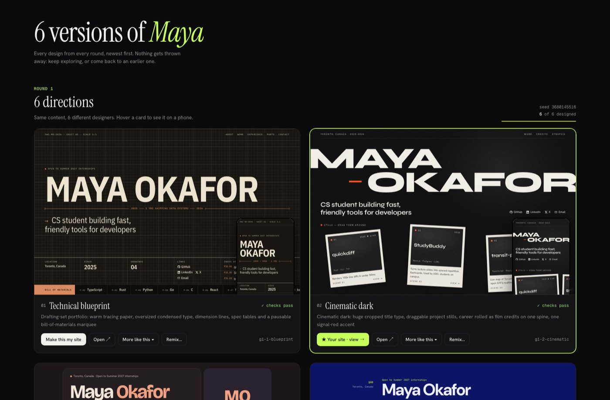

<sub>The gallery: same content, six designs, each a real running site with a phone preview.</sub>

</div>

---

## Not a template

Every portfolio generator gives you the same five themes everyone else has. Folio doesn't pick a theme for you: it **briefs a designer per direction** and your agent builds each one from scratch, around your actual work.

These six came out of a single run on one profile (shown here with the fictional demo profile):

| | | |
|:-:|:-:|:-:|
| 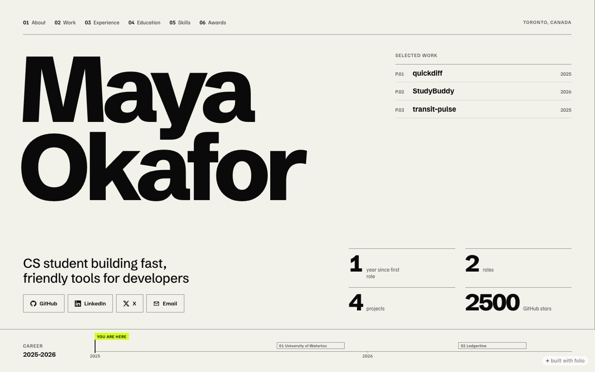 | 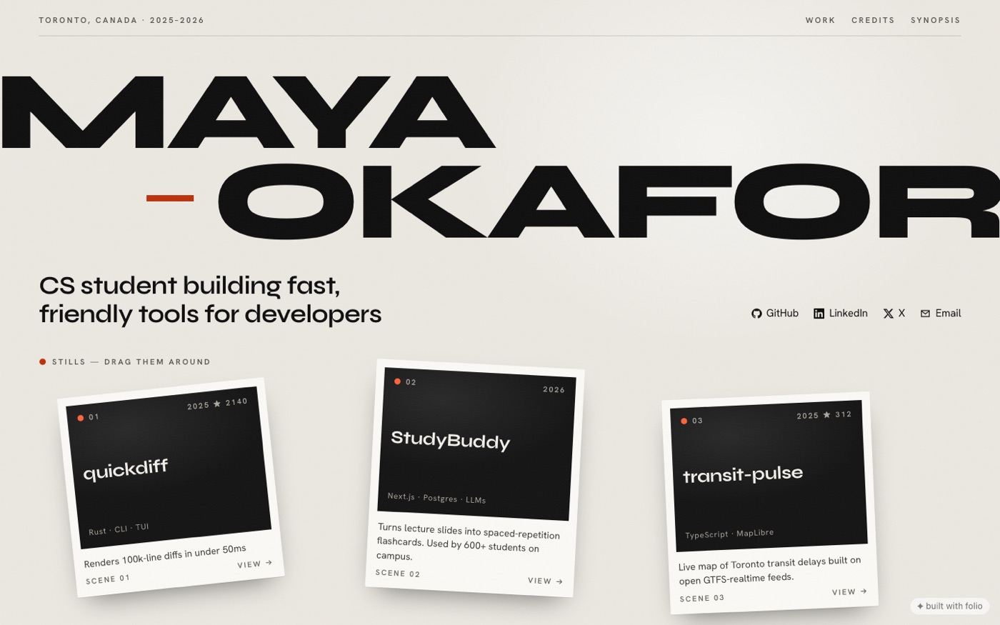 | 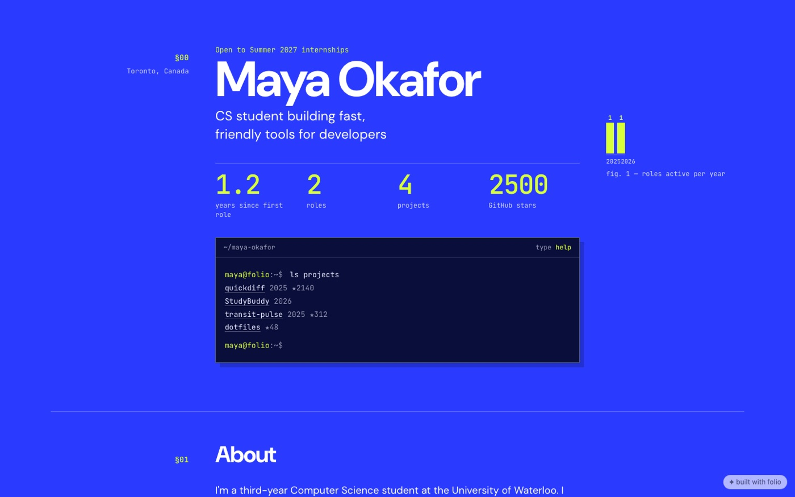 |
| **Swiss poster:** scrolls sideways, career chart pinned to the bottom | **Cinematic:** film title card, draggable project "stills" | **Data-native:** every number computed from your data, plus a terminal visitors can type into |
| 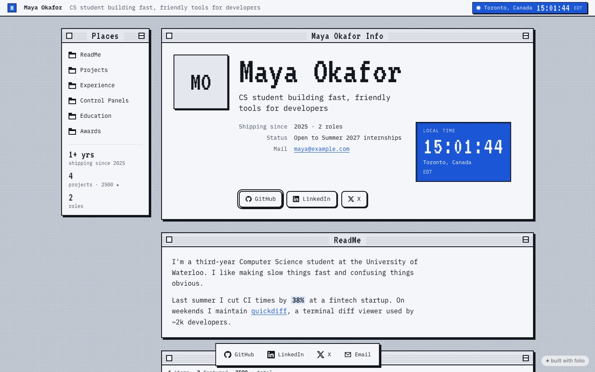 | 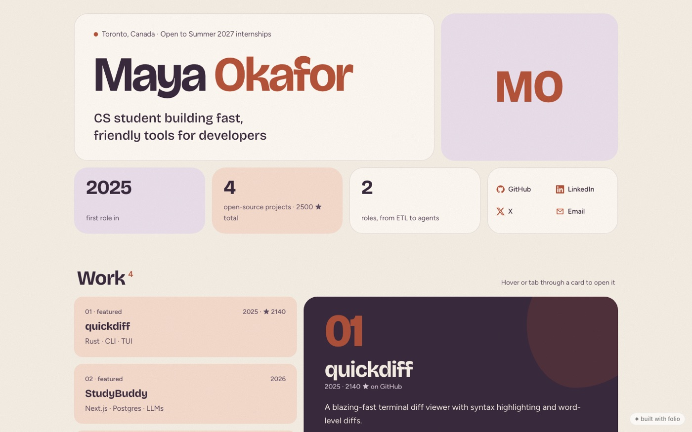 | 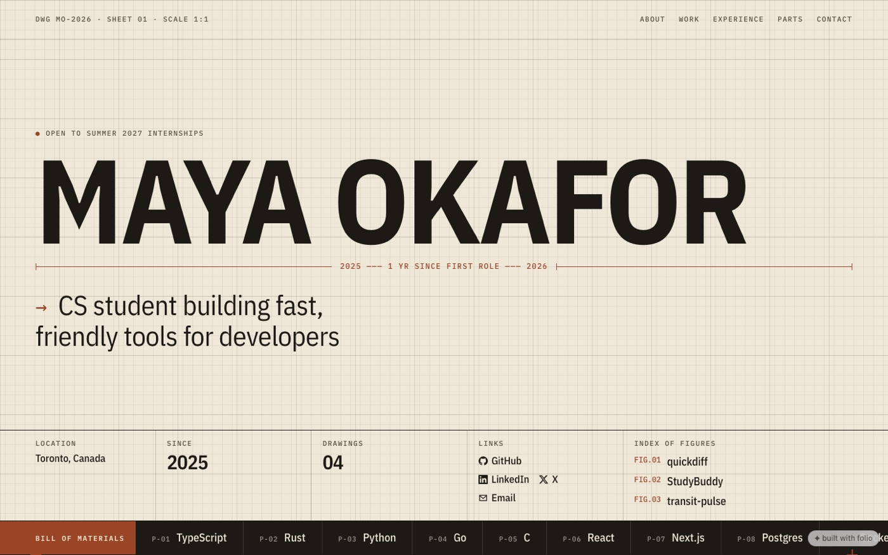 |
| **Retro OS:** projects are files, roles are processes, a live local clock | **Soft:** plum and clay tiles with a hover preview panel | **Blueprint:** an engineering drawing with a scrolling bill of materials |

None of these existed before the run. Run it again and you get six different ones.

## How it works

```text
you   ›  make my portfolio from resume.pdf, my GitHub is octocat
agent ›  reads your resume + repos → writes folio.json (no invented facts)
      ›  folio generate          → 6 design briefs
      ›  designs all 6 in parallel, each checked and screenshot-reviewed
you   ›  open the gallery, click "Make this my site"
      ›  "more like this one, keep the colors"   → 3 siblings, side by side
      ›  folio deploy             → https://you.github.io
```

### 1. Your content, written properly
The agent reads what you already have (resume PDF, GitHub, LinkedIn export, a few sentences) and writes `folio.json`: outcome-first bullets, one-line project pitches, your best repos picked by stars and recency. It **never invents** numbers, employers, dates or degrees. If a bullet needs a number you didn't give, it asks.

### 2. Six briefs, six designers
`folio generate` writes six deliberately different briefs. Each one combines:

- a **direction**: Swiss, editorial, technical blueprint, data-native, brutalist, archive, academic paper, soft, retro OS, zine, cinematic, kinetic type
- a **layout**, a **motion** level, a **palette** strategy and a **type** pairing (never the default AI fonts)
- one **signature moment**: a terminal you can type into, a ⌘K palette, draggable cards, a scroll-driven timeline…

Directions are weighted to who you are, plus at least one wildcard. Your agent designs them in parallel. Before a design counts as done it must pass `folio theme check` (escaping, unsafe links, phones, dark mode, focus styles, reduced motion) and its designer looks at real screenshots of it.

### 3. Folio Studio
`folio studio` opens **Studio** in your browser: your Library of every design from every round, each a live preview. Designs appear as they land. Nothing is ever deleted:

- **Every change is a version.** Edits from Studio, your agent or your own editor are all captured; open any design to see its history, preview an old version and restore it (restoring adds a new version, so nothing is lost).
- **Archive, don't delete.** Archived designs hide from view and come back with one click. Star favorites.
- **Family tree.** Variations show which design they branched from.

- **Make this my site:** sets it in `folio.json` and opens your site.
- **More like this:** asks what you like about it (vibe, colors, typography, layout, signature moment), keeps exactly that, and gets three siblings that each change two big things. They show up next to the original, and you can repeat on the winner until it's yours.
- **Open:** click around the full site.

### 4. Publish
`folio deploy` pushes to the `gh-pages` branch and turns on GitHub Pages. Or point Vercel, Netlify or Cloudflare Pages at `folio build` → `dist/`.

## Quick start

**With an agent** (Claude Code, Cursor, Codex, OpenCode…):

```bash
npx skills add munshi007/folio
```

> make my portfolio from ~/Downloads/resume.pdf, my GitHub is octocat

**Without one:**

```bash
npx folio-site init --github <you>   # profile + top repos → folio.json
npx folio-site dev                   # live preview at localhost:4321
npx folio-site deploy                # publish to GitHub Pages
```

Without an agent you can't generate designs (that's the agent's job), but you get four solid built-in themes, the live preview, and everything else.

## No coding agent? Use your API key

```bash
export ANTHROPIC_API_KEY=sk-ant-...
folio generate --run          # start a round and build it right away
folio run                     # or: do whatever is waiting (rounds, persona, sketches, your resume)
```

With the key set, `folio studio` also shows **Build now with my API key** on every waiting job. The key is only sent to api.anthropic.com and is never saved. Generated designs pass the same checks as agent-made ones, and code that reaches for modules, the process or the network is refused before it's written. Pick a model with `--model` or `FOLIO_MODEL`.

## Use it from your AI app (MCP)

folio is also an MCP server, so Claude, Cursor, Codex, VS Code and other MCP clients can drive it directly: open Studio, read and write the persona, add references, make sketches, start rounds, claim designs, check them.

```bash
claude mcp add folio -- npx -y folio-site@latest mcp     # Claude Code
```

Other clients take the same command in their MCP settings:

```json
{ "mcpServers": { "folio": { "command": "npx", "args": ["-y", "folio-site@latest", "mcp"] } } }
```

The repo is also a Claude Code plugin (skill + MCP server together, see `.claude-plugin/`).

## Tweak without code

The preview has a control bar: pick the **design**, force **light/dark**, swap the **font** (serif, sans, mono), **reorder or hide sections**. Every click is saved to `folio.json`, and works on every design, including generated ones:

```json
{
  "theme": "g1-2-cinematic",
  "accent": "#16a34a",
  "style": { "mode": "dark", "font": "serif", "sections": ["projects", "experience", "about"], "hide": ["awards"] }
}
```

Bigger changes, like *"make the name smaller and the projects louder"*, go to your agent. It edits the design, re-checks it and re-screenshots it.

## Built-in themes

For a quick start without generating, four hand-tuned themes ship with folio: **bento**, **editorial**, **terminal** and **blueprint**. Blueprint was itself the first output of the design loop. They're also the starting points for `folio theme new <name> --from <theme>`.

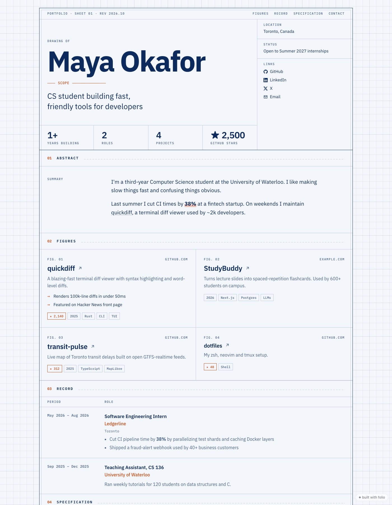 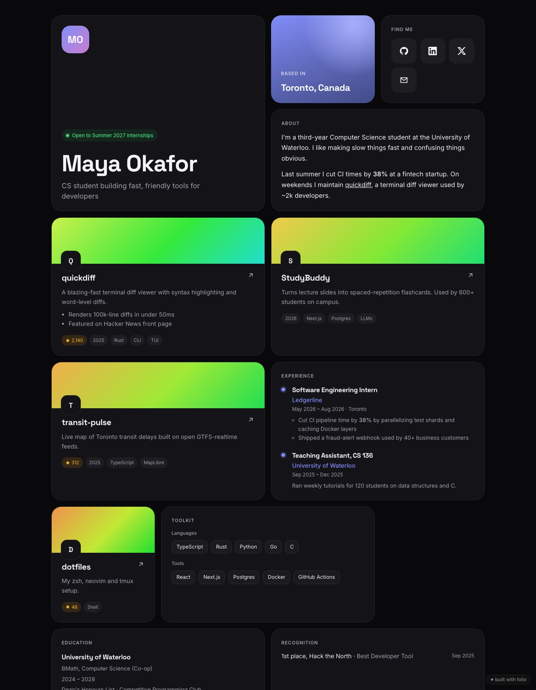 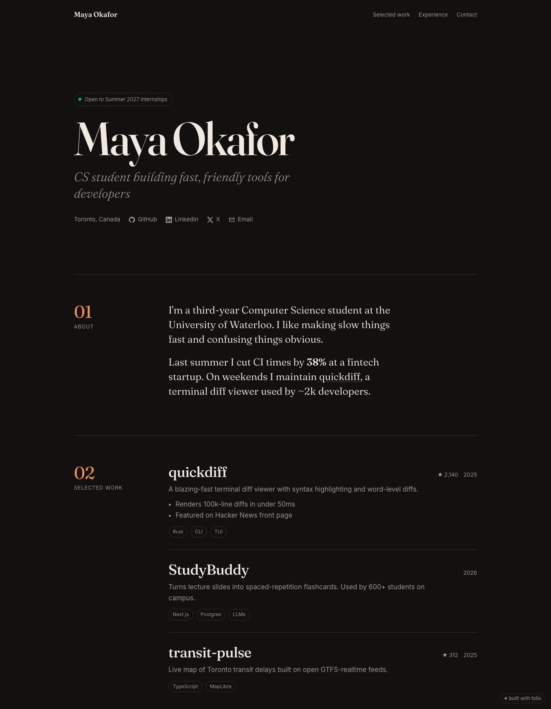 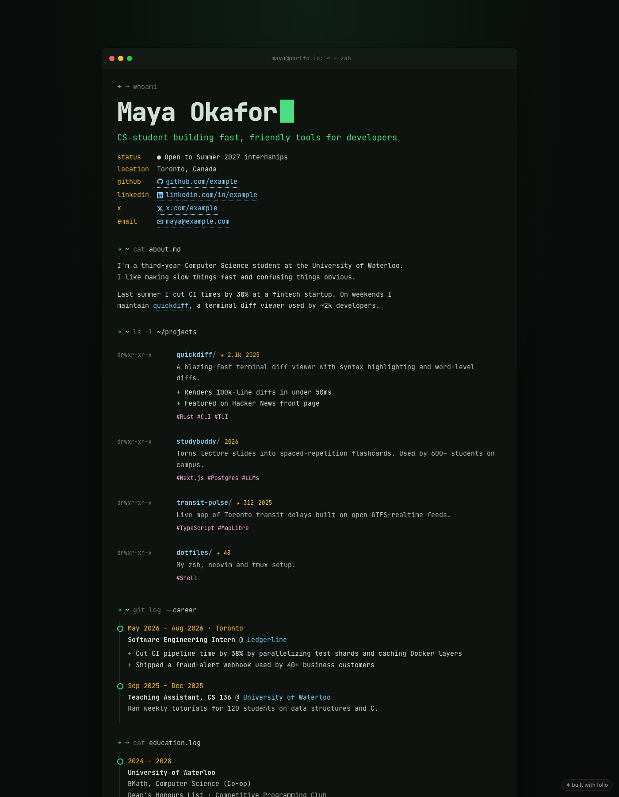

## Commands

| Command | What it does |
|---|---|
| `folio init [--github <user>]` | Create `folio.json`, optionally from your GitHub profile |
| `folio github <user>` | Merge profile + top repos into `folio.json` (never overwrites what you wrote) |
| `folio generate [--count 6] [--seed n]` | Brief N different designers for your agent; watch them land in the gallery |
| `folio generate --like <design> [--keep vibe\|colors\|type\|layout\|signature]` | "More like this": siblings that keep what you liked and change two big things each |
| `folio pick <design> [--as <name>]` | Keep a generated design under a proper name and set it in `folio.json` |
| `folio studio` | Open Folio Studio: Library, Persona, Explore (sketches), Compare + mix, Publish |
| `folio persona [write <file>]` · `folio refs [add <file>]` · `folio sketch auto\|add\|show` | Persona card, reference board, first-screen sketches (agents write; you correct in Studio) |
| `folio jobs [next \| cancel <id>]` | Generation progress; agents claim the next design or task |
| `folio run` | Build waiting designs (and persona, sketches, resume reading) with your own `ANTHROPIC_API_KEY`, no agent needed |
| `folio mcp` | Run as an MCP server for AI apps |
| `folio dev` | The same local server without opening a browser (Studio at `/studio`, your site at `/`) |
| `folio build [--out dist]` | Render the static site |
| `folio deploy` | Build and publish to GitHub Pages (asks first) |
| `folio validate` | Check `folio.json` and get content suggestions |
| `folio themes` | List built-in, local and generated designs |
| `folio theme new <name> [--from <theme>]` | Scaffold your own design in `themes/<name>.js` |
| `folio theme check <name>` | Safety and quality checks for a design |
| `folio shot [--theme <name>] [--pure]` | Full-page shots plus one image per real screen, desktop and phone, light and dark; reports page script errors |

## What you get

- **One static page**, no framework, no build step, nothing in `node_modules`. Fast anywhere.
- SEO and social previews: title, description, Open Graph, JSON-LD `Person` data.
- Dark and light, phones, print, keyboard focus, reduced motion, in every design.
- Your data in one readable file, `folio.json`, so switching designs never touches your content.
- A small "built with folio" link in the corner. Set `"badge": false` to remove it.

## Make your own design

A design is one file that exports `meta` and `render(profile, h)`, returning `{ css, body, fonts?, script? }`. `h` is a helper kit (`h.esc`, `h.attrUrl`, `h.inline`, `h.md`, `h.dateRange`, `h.icon`, `h.ordered`…), and every profile value must go through one of them.

```bash
folio theme new mine --from blueprint   # or start from the bare starter
folio dev --theme mine                  # live preview while you edit
folio theme check mine                  # must pass with 0 errors
folio shot --theme mine                 # see it on desktop and phone
```

The design process the agent follows (brief, directions, critique rubric, banned generic-AI patterns) is in [`skills/folio/DESIGN.md`](skills/folio/DESIGN.md), and the generation flow in [`skills/folio/GENERATE.md`](skills/folio/GENERATE.md). To ship a design as a built-in, add it to `themes/index.js` and run `npm test`, which runs the same checks on every theme.

## License

MIT
