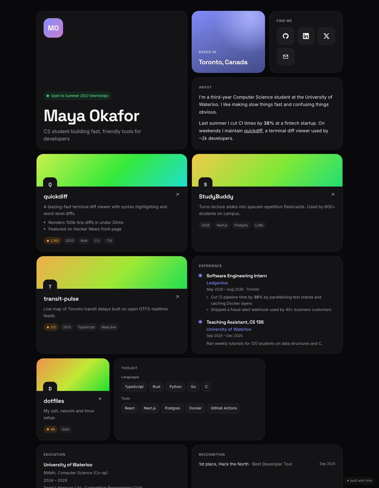
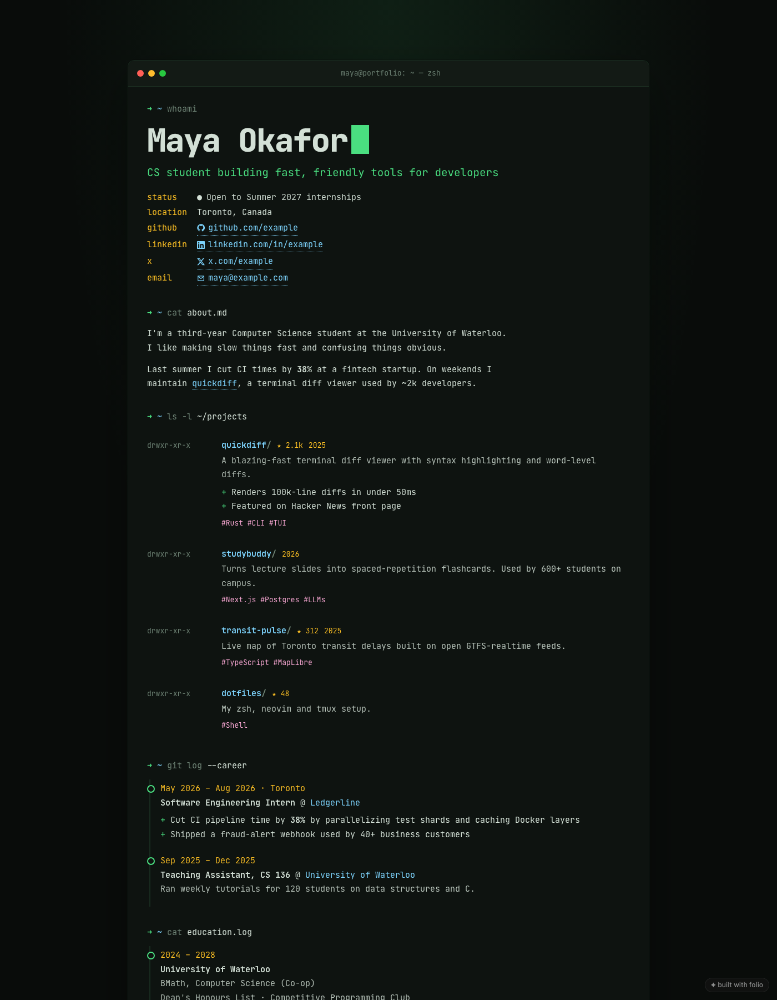

<div align="center">

# ✦ folio

**Your resume + GitHub → a portfolio people actually remember.**
One command. Three gorgeous themes. Free hosting on GitHub Pages. Zero dependencies.

```bash
npx skills add munshi007/folio
```
then tell your agent: *"make my portfolio from resume.pdf"*

<br>

  

<sub>bento · editorial · terminal</sub>

</div>

---

## Why

Most portfolios are either a bare GitHub profile or a template you spend a weekend fighting. Folio gives your AI agent (Claude Code, Cursor, Codex, OpenCode…) a skill that:

1. **Reads what you already have:** resume PDF, GitHub profile, LinkedIn export, a few sentences.
2. **Writes it like a recruiter wants to read it.** Outcome-first bullets, one-line project pitches, and no invented numbers, ever.
3. **Renders a site you'd be proud to share**, with live preview and a theme switcher.
4. **Ships it** to `https://you.github.io` in one command.

No framework, no build step, no `node_modules`. The output is a single fast static page with SEO, social-preview tags and dark mode built in.

## Quick start

### With an AI agent (recommended)

```bash
npx skills add munshi007/folio
```

Then just ask:

> make my portfolio from ~/Downloads/resume.pdf, my GitHub is octocat

The agent extracts your experience, picks your best repos, writes the copy, opens a live preview, and deploys when you say so.

### Without an agent

```bash
npx folio-site init --github <your-username>   # pulls profile + top repos
npx folio-site dev                             # live preview at localhost:4321
# edit folio.json — the page reloads as you type
npx folio-site deploy                          # publish to GitHub Pages
```

## Themes

| | |
|---|---|
| **bento** | Card grid with a cursor spotlight. Bold and modern. Great for students, full-stack and product engineers. |
| **editorial** | Magazine-style serif layout with numbered sections. Great for designers, writers, researchers and PMs. |
| **terminal** | Your portfolio as a shell session, with `git log --career`. Great for systems, backend, infra and security folks. |

Switch anytime with `"theme"` in `folio.json`, `--theme`, or the bar at the bottom of `folio dev`. Set `"accent": "#hex"` for your brand color. Every theme handles light/dark mode, mobile, print, and `prefers-reduced-motion`.

## Commands

| Command | What it does |
|---|---|
| `folio init [--github user]` | Create `folio.json`, optionally from your GitHub profile |
| `folio github <user>` | Merge your GitHub profile + top repos into an existing `folio.json` (never overwrites what you wrote) |
| `folio dev` | Live preview with hot reload and theme switcher |
| `folio build [--out dist]` | Render the static site |
| `folio deploy` | Build and publish to the `gh-pages` branch, then enable GitHub Pages |
| `folio validate` | Check `folio.json` and get content suggestions |
| `folio themes` | List themes |

## `folio.json`

Everything lives in one human-readable file. Only `name` is required, and empty sections are hidden.

```json
{
  "theme": "bento",
  "name": "Maya Okafor",
  "headline": "CS student building fast, friendly tools for developers",
  "status": "Open to Summer 2027 internships",
  "about": "I like making slow things fast. Last summer I cut CI times by **38%**.",
  "links": [{ "label": "GitHub", "url": "https://github.com/maya" }],
  "projects": [{ "name": "quickdiff", "description": "Blazing-fast terminal diffs.", "repo": "https://github.com/maya/quickdiff", "stars": 2140, "featured": true }],
  "experience": [{ "role": "SWE Intern", "org": "Ledgerline", "start": "2026-05", "end": "2026-08", "highlights": ["Cut CI time 38% by parallelizing test shards"] }],
  "education": [{ "school": "University of Waterloo", "degree": "BMath, Computer Science", "start": "2024", "end": "2028" }],
  "skills": [{ "group": "Languages", "items": ["TypeScript", "Rust", "Python"] }]
}
```

Full schema: [`skills/folio/SKILL.md`](skills/folio/SKILL.md#foliojson-schema). Full example: [`examples/folio.example.json`](examples/folio.example.json).

## Deploying

`folio deploy` pushes the built site to the `gh-pages` branch of your repo's `origin` (replacing that branch only) and turns on GitHub Pages if the `gh` CLI is logged in.

- Want `https://<you>.github.io/` at the root? Name the repo `<you>.github.io`.
- Prefer Vercel, Netlify or Cloudflare Pages? Point them at `folio build` with output directory `dist`.

## Contributing a theme

A theme is one file in `themes/` that exports `meta` and `render(profile) → { css, body, fonts?, script? }`. Values from the profile must go through `esc()` / `attrUrl()` / `inline()` from `src/util.js`, and the tests check that every theme escapes hostile input. Add it to `themes/index.js` and run `npm test`.

## License

MIT
